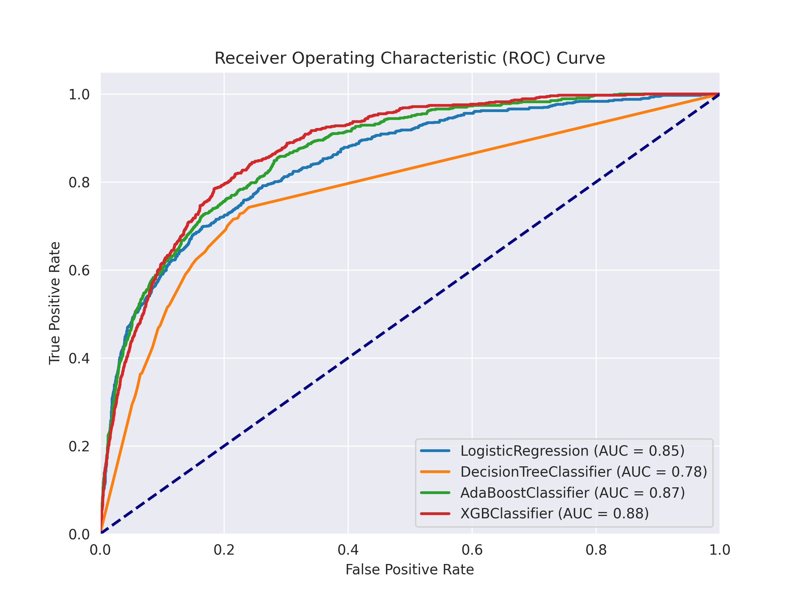
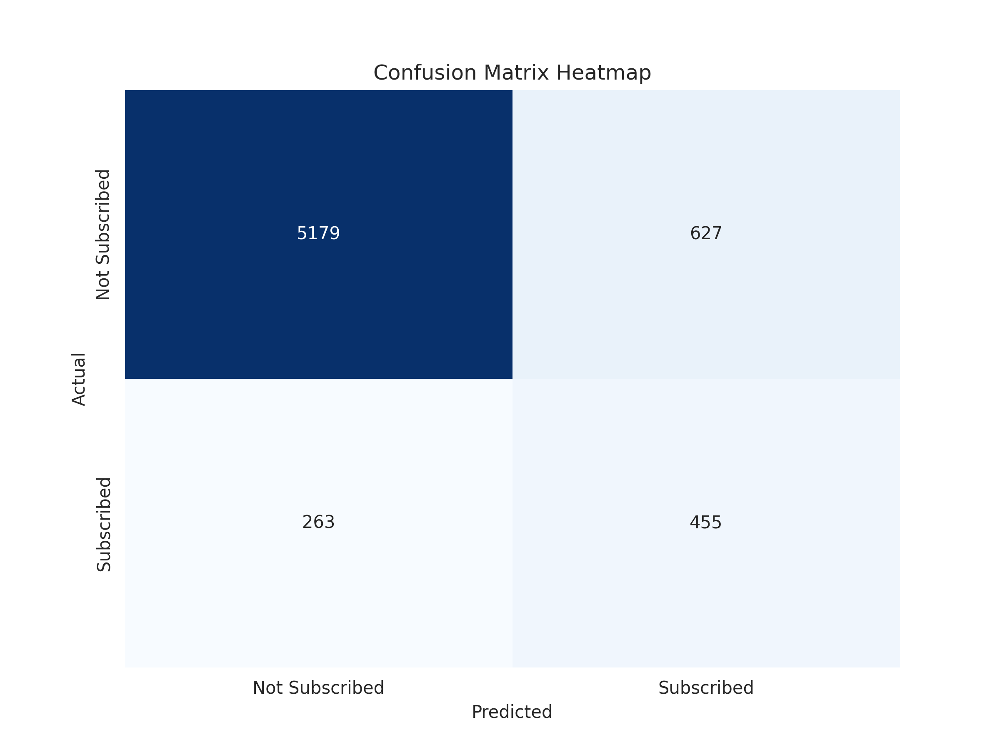

# Marketing Campaign Analytics

## Introduction
In today's competitive financial landscape, effective marketing strategies are crucial for banks aiming to attract and retain customers for term deposits. This project analyzes a dataset from a time deposit campaign to derive actionable insights and recommendations for optimizing campaign effectiveness.

Through detailed analysis, this project aims to identify patterns and correlations that influence term deposit subscriptions. By leveraging these insights, banks can refine their marketing strategies to better target and engage potential customers. This approach not only enhances subscription rates but also improves resource allocation and customer retention efforts.

## Objectives
1. **Data Exploration:** Investigate customer attributes and campaign details.
2. **Predictive Modeling:** Develop machine learning models to forecast term deposit subscriptions.
3. **Evaluation:** Measure model performance using metrics such as ROC AUC, precision, recall, and F1-score.
4. **Business Recommendations:** Provide strategic insights to optimize future marketing efforts and increase subscription rates effectively.

## Dataset Information
The "bank target marketing" dataset is a collection of data focused on a bank's marketing campaign to acquire deposits from customers. This dataset contains various attributes related to customer demographics, their previous interactions with the bank, and the outcomes of the marketing campaign conducted.

### Attribute Data
- **age**: The age of the customer.
- **job**: The occupation/employment status of the customer.
- **marital**: The marital status of the customer.
- **education**: The education level attained by the customer.
- **default**: Whether the customer has credit in default or not.
- **housing**: Whether the customer has a housing loan or not.
- **loan**: Has personal loan?
- **contact**: Type of communication used to contact customers (phone, cellular, etc.).
- **month**: Last contact month of year.
- **day_of_week**: Last contact day of the week.
- **duration**: Last contact duration in seconds.
- **campaign**: Number of contacts performed during this campaign for the customer.
- **pdays**: The number of days passed by after contact from the previous campaign.
- **previous**: Number of contacts performed before this campaign for the customer.
- **poutcome**: Outcome from the previous marketing campaign.
- **y**: Has the client subscribed a term deposit?

## Model Evaluation
### ROC Curve

### Classification Report - XGBClassifier Model
|            | Precision | Recall | F1-Score | Support |
|------------|-----------|--------|----------|---------|
| 0          | 0.95      | 0.89   | 0.92     | 5790    |
| 1          | 0.42      | 0.63   | 0.51     | 734     |
|------------|-----------|--------|----------|---------|
| **Accuracy**|           |        | 0.86     | 6524    |
| **Macro Avg**| 0.69      | 0.76   | 0.71     | 6524    |
| **Weighted Avg**| 0.89  | 0.86   | 0.87     | 6524    |

### Confusion Matrix - XGBClassifier Model (Best Model)

### Conversion Rate Analysis
- Conversion Rate (without model): 11.25%
- Conversion Rate (with model): 42.35%

## Business Recommendations
Based on insights from the campaign data, here are strategic recommendations:
- Focus on customers aged 30-40 years and explore opportunities with younger (students) and older (retirees) demographics.
- Prioritize interactions lasting more than 5 minutes to increase subscription likelihood.
- Target educated individuals and develop tailored marketing strategies for single customers.
- Optimize campaign frequency to around 2000 activities per period (month) for effectiveness.
- Implement retention strategies for previous subscribers to enhance customer loyalty.

By implementing these recommendations, the campaign can optimize resource allocation, enhance engagement, and improve term deposit subscription rates effectively.
